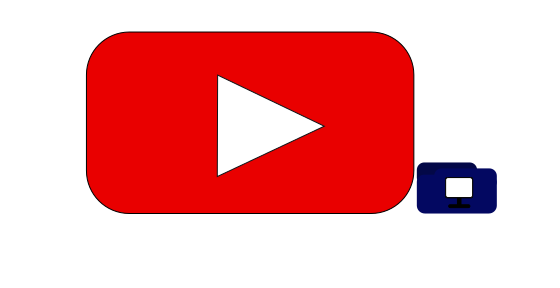
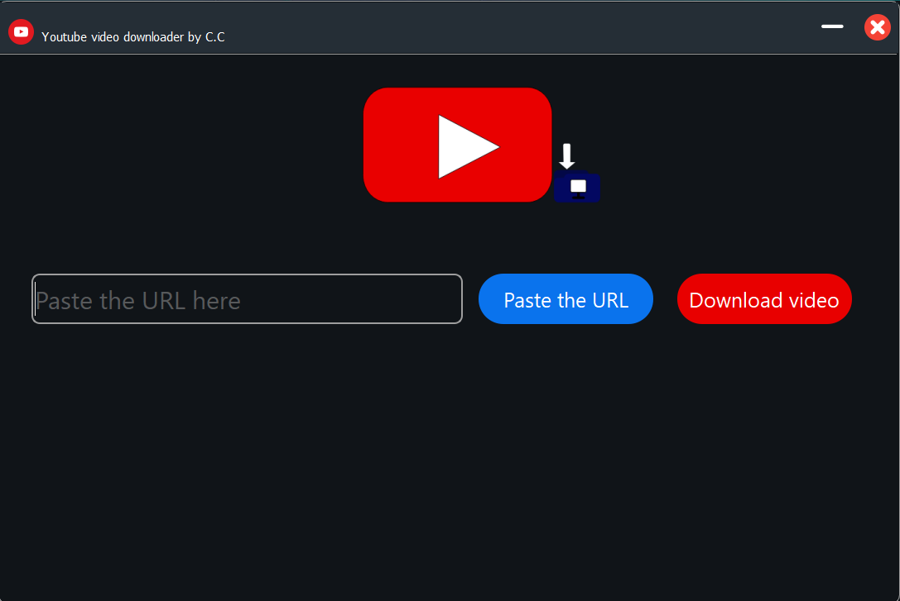
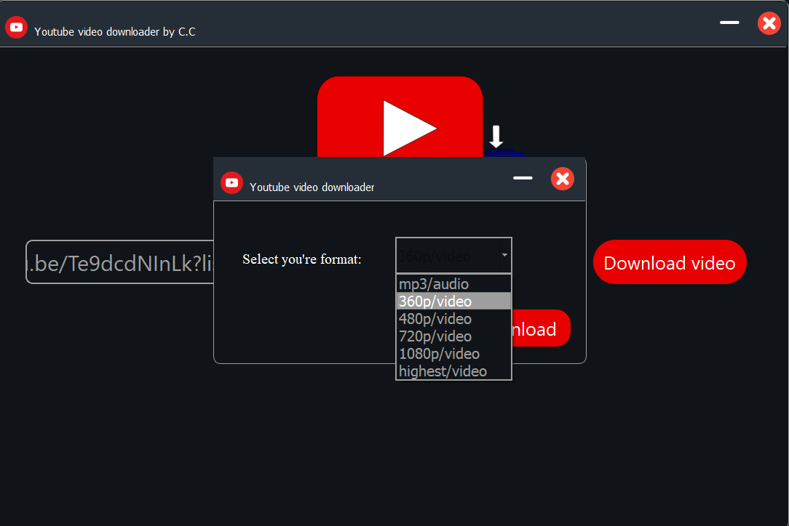
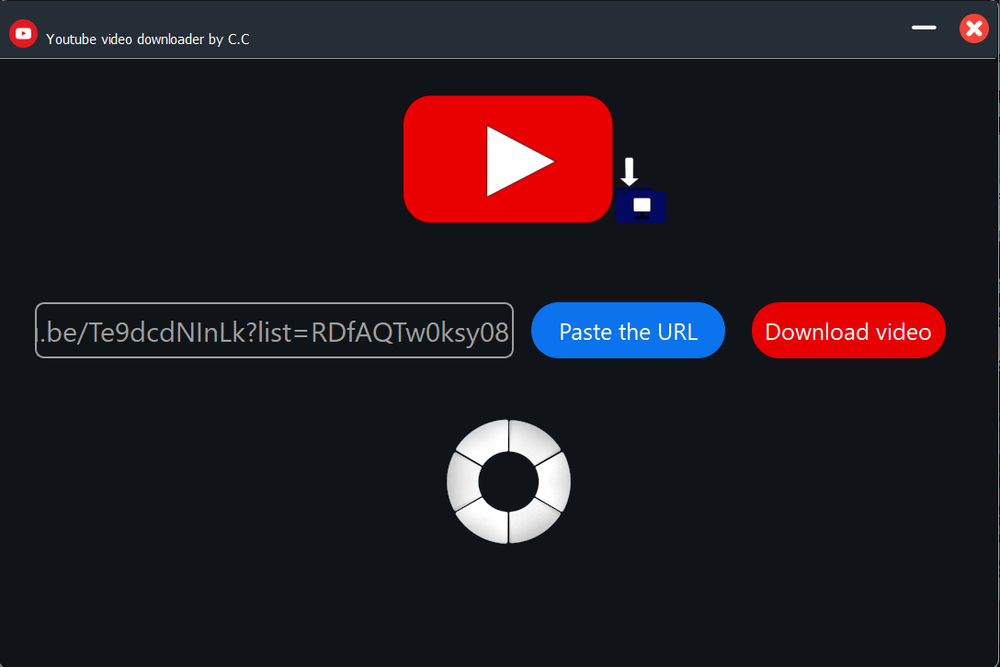
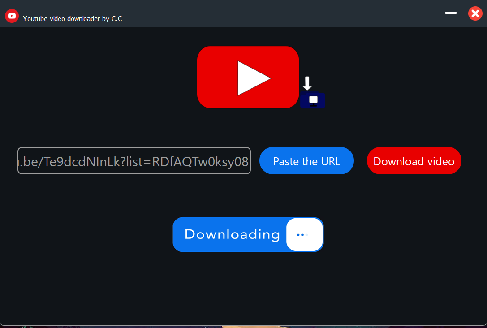
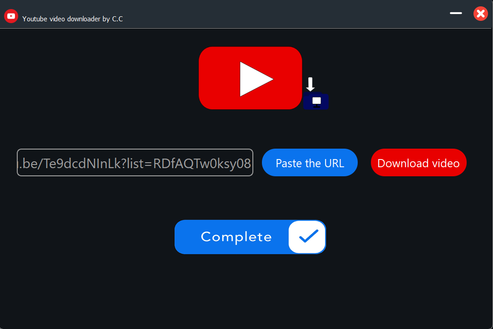

# Youtube video downloader

> An app to download you're favorite youtube videos and songs.

### Table of Contents
---

- [Youtube video downloader](#youtube-video-downloader)
    - [Table of Contents](#table-of-contents)
  - [Description](#description)
  - [Purpose for creation](#purpose-for-creation)
      - [Technologies that used](#technologies-that-used)
      - [NOTE - This application was made for educational purposes only. Also many of the youtube videos have copyright claims I'm NOT responsible for any kind of reselling of the videos that's been downloaded and I'm also not reccomending doing so. even though the use of application is completely free. Use this to download and enjoy you're favorite videos in youtube NOT for financial gain.](#note---this-application-was-made-for-educational-purposes-only-also-many-of-the-youtube-videos-have-copyright-claims-im-not-responsible-for-any-kind-of-reselling-of-the-videos-thats-been-downloaded-and-im-also-not-reccomending-doing-so-even-though-the-use-of-application-is-completely-free-use-this-to-download-and-enjoy-youre-favorite-videos-in-youtube-not-for-financial-gain)
  - [How To Use](#how-to-use)
    - [Installation](#installation)
      - [WARNING - Not having a stable internet connection can cause unexpected errors](#warning---not-having-a-stable-internet-connection-can-cause-unexpected-errors)
  - [License](#license)
  - [Screenshots](#screenshots)
  - [Author Info](#author-info)

## Description

This is a free and open source youtube video downloading application that you can use to download you're youtube videos in different resolutions and even in mp3 audio formats

## Purpose for creation

This application was created by Chamodya Chirath as a personal challenge and to test his knowledge in python, PyQt5 GUI library,automation, threading and multiprocessing

#### Technologies that used

- Python
- PyQt5
- pytube
- ffmpeg

#### NOTE - This application was made for educational purposes only. Also many of the youtube videos have copyright claims I'm NOT responsible for any kind of reselling of the videos that's been downloaded and I'm also not reccomending doing so. even though the use of application is completely free. Use this to download and enjoy you're favorite videos in youtube NOT for financial gain.

[Back To The Top](#Youtube-video-downloader)

## How To Use

- You can download the repository by clicking "code" and downloading zip file
- After that you need to extract the zip file.
- Then open the "main.py" file and run it make sure you're virtual environment is correct

### Installation

Method 1
 - Go to the bin folder and run the youtubedownloader_V1.0.exe setup file

Method 2
  - If the first method doesn't work go to the bin folder and extract the "youtube_video_downloader.rar" file in to you're computer

You can use these methods to use the application in a windows operating system. Python install is not necessary in the insallation methods but it is needed if you're trying to run the file using "main.py" file

#### WARNING - Not having a stable internet connection can cause unexpected errors

## License

MIT License

Copyright (c) [2024] [Chamodya chirath]

Permission is hereby granted, free of charge, to any person obtaining a copy
of this software and associated documentation files (the "Software"), to deal
in the Software without restriction, including without limitation the rights
to use, copy, modify, merge, publish, distribute, sublicense, and/or sell
copies of the Software, and to permit persons to whom the Software is
furnished to do so, subject to the following conditions:

The above copyright notice and this permission notice shall be included in all
copies or substantial portions of the Software.

THE SOFTWARE IS PROVIDED "AS IS", WITHOUT WARRANTY OF ANY KIND, EXPRESS OR
IMPLIED, INCLUDING BUT NOT LIMITED TO THE WARRANTIES OF MERCHANTABILITY,
FITNESS FOR A PARTICULAR PURPOSE AND NONINFRINGEMENT. IN NO EVENT SHALL THE
AUTHORS OR COPYRIGHT HOLDERS BE LIABLE FOR ANY CLAIM, DAMAGES OR OTHER
LIABILITY, WHETHER IN AN ACTION OF CONTRACT, TORT OR OTHERWISE, ARISING FROM,
OUT OF OR IN CONNECTION WITH THE SOFTWARE OR THE USE OR OTHER DEALINGS IN THE
SOFTWARE.

[Back To The Top](#Youtube-video-downloader)

## Screenshots
 
 

 

 

 

 

## Author Info

- Name: Chamodya Chirath
- chamodyachirath@gmail.com
- Linkedin account -https://www.linkedin.com/in/chirath-abeymanna-990700292
- Status: First year undergraduate student at Univeristy of Westminster.(Conducted by Infomatics Institute of Technology - Sri Lanka)

[Back To The Top](#Youtube-video-downloader)
